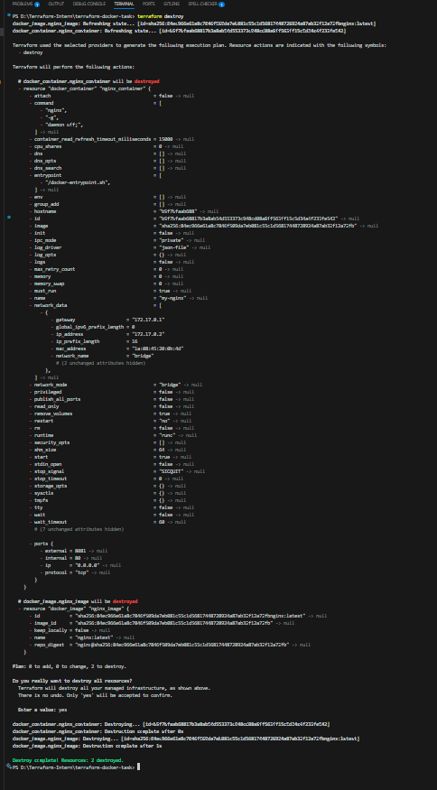

# Terraform Docker Task

This project uses **Terraform** to provision a simple **Nginx Docker container** on your local machine.  
It is designed for learning and practicing **Infrastructure as Code (IaC)** with Terraform and Docker.

---

## 📦 Prerequisites

- [Docker](https://docs.docker.com/get-docker/) installed and running
- [Terraform](https://developer.hashicorp.com/terraform/downloads) installed and configured
- Git installed

---

## 📦 Technologies Used

  Terraform – Infrastructure as Code
  Docker – Containerization
  VS Code – Editor
  Local System – for provisioning

## 📁 Project Structure

terraform-docker-task/
│
├── .terraform/                   
│
├── screenshots/                  
│   ├── browser.png
│   ├── terraform-apply.png
│   └── terraform-destroy.png
│
├── main.tf                       
├── README.md                     
├── terraform.tfstate             
├── terraform.tfstate.backup      
├── .terraform.lock.hcl      

## Initialize Terraform
    terraform init

## Plan the Execution
    terraform plan

## Apply the Configuration
    terraform apply

## Type -> yes 

🌐 Access Nginx in Browser
     http://localhost:8081

## To Clean Up
    terraform destroy

##  📸  Screenshots

### 🔹 Browser Output (After Docker Container Runs)

---

### 🔹 Terraform Apply Output

---

### 🔹 Terraform Destroy Output

  
